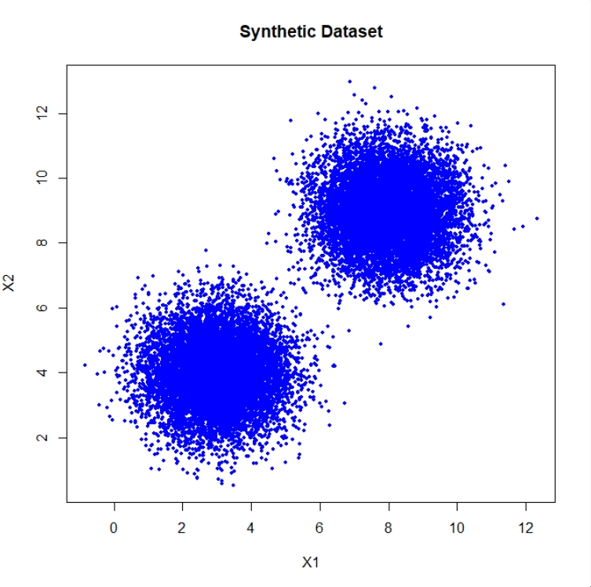
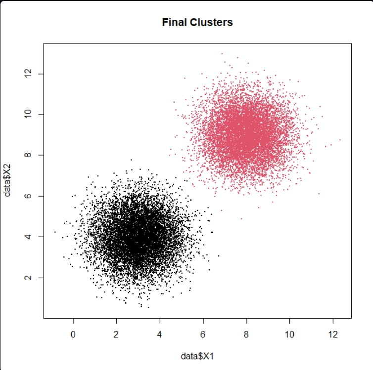
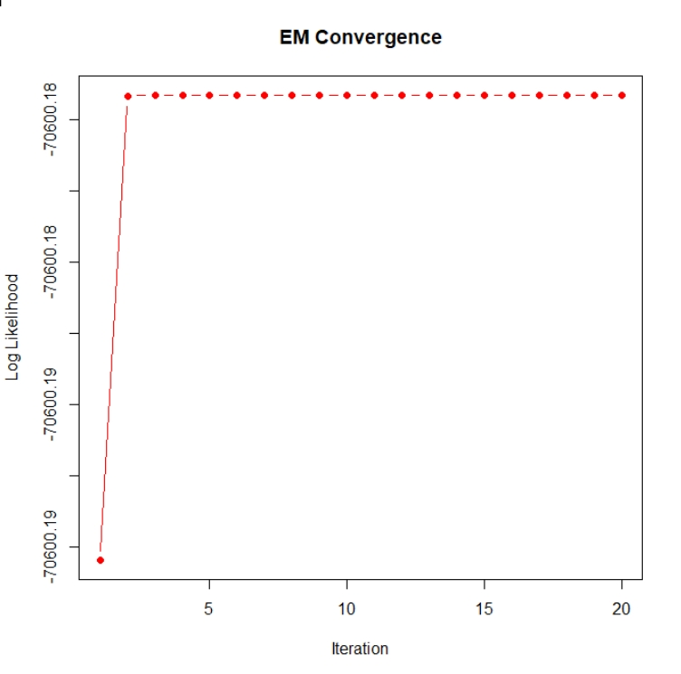

# Gaussian Mixture Model using Expectation-Maximization (EM) Algorithm

## 🎯 Project Objective
The objective of this project is to implement the Gaussian Mixture Model (GMM) using the Expectation-Maximization (EM) Algorithm from scratch in R.  
This project demonstrates probabilistic clustering without using external ML libraries.

---

## 🧰 Software Used
- R (v4.x)
- R GUI / RStudio
- GitHub

---

## 📊 Dataset
A synthetic dataset containing 20,000 observations generated using Base R.

Variables:
- X1
- X2

Saved as: `synthetic_data.csv`

---

## ⚙️ Steps to Run the Program
1. Open `gmm_em_algorithm.R` in RStudio.
2. Run: `source("gmm_em_algorithm.R")`
3. The algorithm generates and saves `data.csv`.
4. Executes E‑Step and M‑Step iteratively.
5. Stops when log‑likelihood converges.
6. Output images are saved in the `output/` folder:
   - `synthetic_dataset.png`
   - `final_clusters.png`
   - `log_likelihood.png`

---

## 📁 Project Folder Structure

   gmm_em_algorithm/
│
├── data/
│   └── synthetic_data.csv
│
├── output/
│   ├── synthetic_dataset.png
│   ├── final_clusters.png
│   └── log_likelihood.png
│
├── gmm_em_algorithm.R
└── README.md

---

## 📸 Output Screenshots
### 1. Synthetic Dataset

### 2. Final Cluster Assignment

### 3. Log-Likelihood Plot

---

## 🧠 Learning Outcomes
- Understand unsupervised learning.
- Differentiate K‑Means and GMM.
- Implement EM algorithm steps.
- Visualize clustering results.
- Upload project to GitHub.

---

## 👩‍💻 Author
**Student Name:** Akshaya  
**Course:** BCA  
**Project Week 1:** Gaussian Mixture Model using EM Algorithm  
**Language:** Base R

